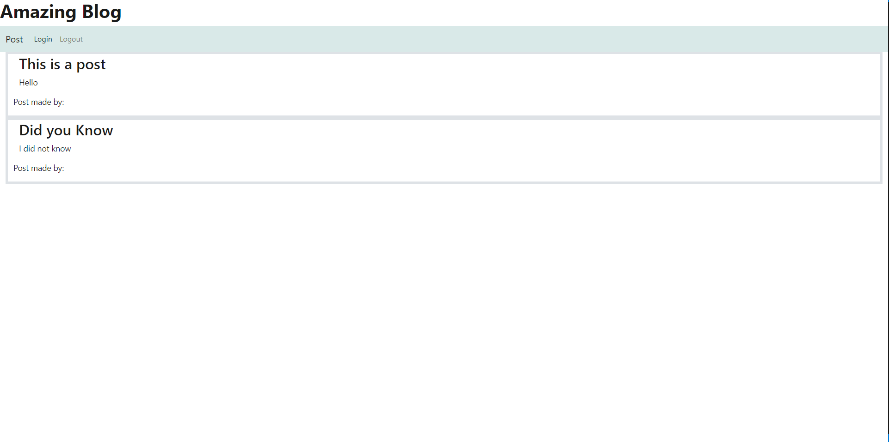

# WeekFourteenChallenge_TechBlog

## Description

My motivation for making this project was to make a porject using backend features and frontend features. I built this project to show that I know how to use sessions and handlebars together to create a better website. This application solves the problem of being able to easily see what other people are talking about. I learned from making this project was how sessions and sequelize and handlebars all interact with each other.

## Installation

You will need to install node.
You will need to install bcrypt.
You will need to install express.
You will need to install mysql2.
You will need to install sequelize.
You will need to install dotenv.
You will need to install express-handlebars.
You will need to install express-session.
You will need to install connect-session-sequelize.

## Usage

You can login by going clicking on the login button. You can logout by going clicking on the logout button. You can click on a post to edit it or delete it. You can click on post to post something.

Link to my repository: (https://github.com/FoundEven/WeekFourteenChallenge_TechBlog)
